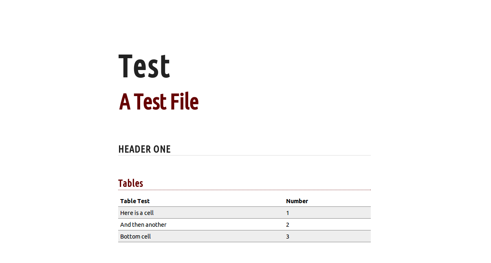

This script converts markdown files to HTML with readability in mind.

It also adds some cool features like timestamping and sortable column tables. And the resulting HTML file is self-contained.

You can easily tweak the looks by tweaking the `default.css` file.

# How To Use
1. Make sure you have `ruby` installed
2. Install [pandoc](http://johnmacfarlane.net/pandoc/)
3. `./markdown_to_html test:-a-test-file.md > test.html`
4. Open `test.html` in your browser

And read your markdown files in style.

# Screenshot
Here is what it looks like in HTML.

# Tools Remixed
- [ruby](https://www.ruby-lang.org)
- [jquery.js](http://jquery.com/)
- [sorttable.js](http://www.kryogenix.org/code/browser/sorttable/)
- [markdown](http://daringfireball.net/projects/markdown/)
- [pandoc](http://johnmacfarlane.net/pandoc/)
- [ubuntu font](http://font.ubuntu.com/)
